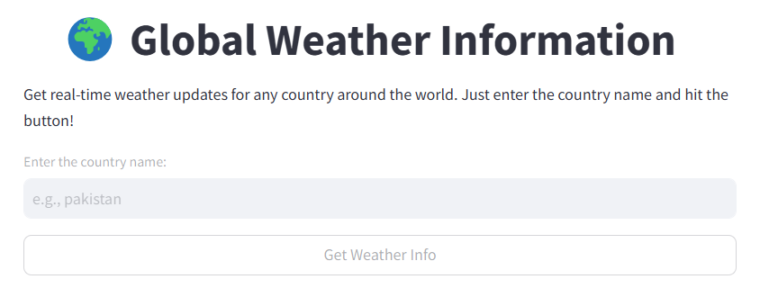

# Weather_CustomGPT

Weather_CustomGPT is a Streamlit application that provides real-time weather updates for any country around the world using the MetaAI API.

## Setup

1. Clone the repository:
    ```sh
    git clone https://github.com/mfahadjbr/Weather_CustomGPT.git
    cd Weather_CustomGPT
    ```

2. Install the required dependencies:
    ```sh
    pip install -r requirements.txt
    ```

3. Run the application:
    ```sh
    streamlit run app.py
    ```

## Usage

1. Open the application in your web browser.
2. Enter the name of the country you want to get weather information for.
3. Click the "Get Weather Info" button.
4. The application will display the weather details in a structured format.

## Weather_CustomGPT Image



## Example

Here are the current weather details for Pakistan:
- **Temperature:** 18°C
- **Weather:** Partly Cloudy
- **Wind:** 15 km/h
- **Humidity:** 60%
- **Precipitation:** 0 mm
- **Cloud Cover:** 40%
- **Wind Direction:** North East
- **Wind Speed:** 15 km/h
- **Visibility:** 10 km
- **Pressure:** 1013 hPa
- **Dew Point:** 8°C
- **UV Index:** 6
- **Sunrise:** 06:30
- **Sunset:** 17:30
- **Moon Phase:** Waning Gibbous
- **Moon Illumination:** 82%

Please note that these details are for the general region of Pakistan. If you would like to know the weather for a specific city, please let me know!


# Beginner
Agar app.py ka code samajh nahi aya to simple_way_for_beginner.py file check kar lena.